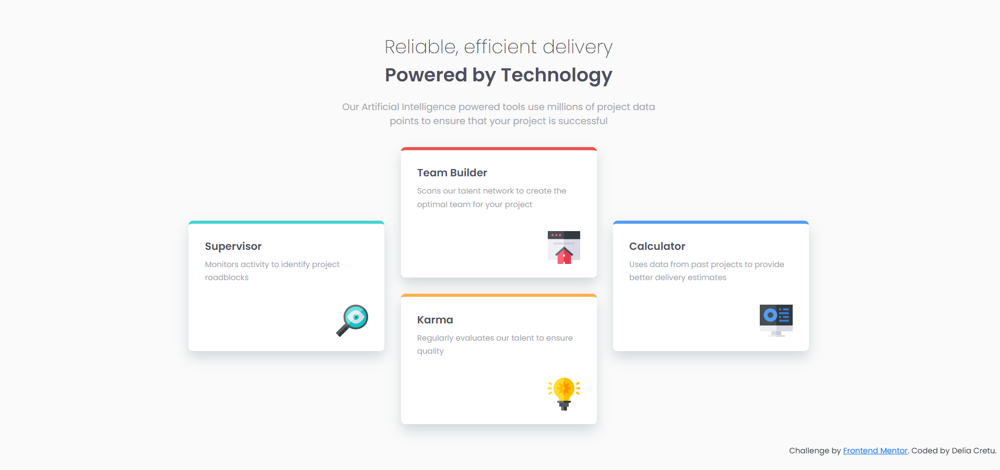

# Frontend Mentor - Four card feature section solution

This is a solution to the [Four card feature section challenge on Frontend Mentor](https://www.frontendmentor.io/challenges/four-card-feature-section-weK1eFYK). Frontend Mentor challenges help you improve your coding skills by building realistic projects.

## Table of contents

- [Overview](#overview)
  - [The challenge](#the-challenge)
  - [Screenshot](#screenshot)
  - [Links](#links)
- [My process](#my-process)
  - [Built with](#built-with)
  - [What I learned](#what-i-learned)
  - [Continued development](#continued-development)
  - [Useful resources](#useful-resources)

## Overview

### The challenge

Users should be able to:

### Screenshot

### Links

- Solution URL: https://github.com/delia-cretu/four-card-feature-section-master
- Live Site URL: https://delia-cretu.github.io/four-card-feature-section-master/

## My process

### Built with

- Semantic HTML5 markup
- CSS custom properties
- CSS Grid

### What I learned

I figured out how to place the 4 boxes into a grid with three columns and re-arrange the grid into rows for a mobile-responsive layout.

### Continued development

I continue to improve my knwoledge of CSS Grid.

### Useful resources

- https://www.digitalocean.com/community/tutorials/css-align-justify This resource helped me understand better how to center items with CSS Grid.
